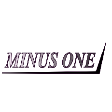

### *Engineering Simplicity in a Complex Digital World*

---

---

##  

**Minus One Enterprise** is a privately held, technology-driven organization dedicated to building enterprise-grade software systems that eliminate unnecessary complexity from modern digital interactions.

We engineer powerful, scalable platforms that combine rigorous backend architecture, intuitive user experiences, and cloud-native infrastructure. Our portfolio spans both **proprietary enterprise products** and **open-source developer tools**.

> *The best technology is not the most complex it is the technology that removes complexity.*

The name **Minus One** embodies our core philosophy: reduce friction, eliminate inefficiency, and deliver systems that work seamlessly for the people who depend on them.

---

##  

We build and maintain two product lines: a proprietary production grade student recommerce platform and an open-source AI tool.

 

###            SaraSell — The Modern Digital Marketplace Platform

 

**SaraSell** is the proprietary platform developed and operated by Minus One Enterprise.

SaraSell is a modern digital marketplace built to transform peer-to-peer student recommerce delivering a **fast, secure, and frictionless** experience for buyers and sellers alike.

| Capability | Description |
|:-----------|:------------|
| **Product Listing** | Streamlined, intuitive listing workflows for any product category |
| **Marketplace Discovery** | Intelligent search and discovery across community listings |
| **Peer-to-Peer Commerce** | Direct, secure connections between buyers and sellers |
| **Performance** | Low-latency, high-throughput architecture built for scale |
| **Security** | End-to-end secure transactions and user data protection |
| **Scalability** | Designed to grow from local communities to global commerce ecosystems |

All SaraSell source code, systems, designs, and documentation are **strictly proprietary and confidential**. Access is granted on a need-to-know basis under enterprise-grade access controls and NDAs.

 

---

 

###  ExplainIt - Transform Complex Jargon into Simple Language

 

 

**ExplainIt** is an open-source AI-powered web application that transforms dense technical jargon, academic terminology, and industry-specific language into clear, beginner-friendly explanations. Built with React, Spring Boot, and Google Gemini AI.

| Capability | Description |
|:-----------|:------------|
| **AI-Powered Simplification** | Gemini AI analyzes context and produces structured, beginner-friendly breakdowns |
| **Smart Fallbacks** | Automatic failover across multiple Gemini model variants |
| **Text-to-Speech** | Built-in voice synthesis to listen to explanations |
| **Glassmorphism UI** | Modern frosted-glass aesthetic with dark/light mode support |
| **Google OAuth** | Secure authentication via Google sign-in |
| **Docker Support** | Multi-stage Dockerfile for containerized deployments |

ExplainIt is fully open-source under the MIT License. Contributions, bug reports, and feature requests are welcome.

[View Repository](https://github.com/StellarStacker/Explain-it) &nbsp;&bull;&nbsp; [Live Demo](https://explainit.netlify.app) &nbsp;&bull;&nbsp; [Report Bug](https://github.com/StellarStacker/Explain-it/issues/new?labels=bug&template=bug_report.md) &nbsp;&bull;&nbsp; [Request Feature](https://github.com/StellarStacker/Explain-it/issues/new?labels=enhancement&template=feature_request.md)

---

##  

All Minus One Enterprise systems are built on a modern, battle-tested, enterprise-grade technology stack.

### Backend

### Frontend

### Infrastructure

| Layer | Technology | Purpose |
|:------|:-----------|:--------|
| **Backend** | Java + Spring Boot | Robust, secure, scalable REST APIs and business logic |
| **Frontend** | React + JavaScript | Responsive, component-driven user interfaces |
| **Containerization** | Docker | Consistent, reproducible build and deployment environments |
| **Infrastructure** | Cloud-Native | Elastic, fault-tolerant deployment across cloud environments |

---

##  

Every system we build is guided by five core engineering principles:

### 1. Build for Real Problems
Technology should solve real-world challenges. We do not build for theoretical elegance — we build for measurable human impact.

### 2. Simplicity Over Complexity
The best systems remain understandable and maintainable at scale. We pursue clarity in architecture and code as a first-class engineering goal.

### 3. Scalable Architecture
Every platform is designed with future growth in mind. Our systems evolve as demands increase — without requiring fundamental rewrites.

### 4. Security by Design
Secure data handling, authentication systems, and privacy protection are baked into our architecture from day one — not added as an afterthought.

### 5. Continuous Innovation
We continuously evaluate modern frameworks, cloud technologies, and emerging engineering practices to keep our systems ahead of the curve.

---

##  

> To create a new generation of intelligent digital platforms that simplify how people interact with technology and commerce.

We aim to build systems that are:

- **Powerful yet simple** — full capability without unnecessary cognitive load
- **Scalable yet maintainable** — growth should not mean chaos
- **Modern yet accessible** — cutting-edge technology that real people can use

---

##  

> To engineer technology that removes complexity and empowers people to interact with digital systems more efficiently.

---

##  

Minus One Enterprise operates as a **professional technology organization** with both proprietary and open-source initiatives.

- All proprietary systems (SaraSell) are internally managed under strict confidentiality agreements
- Access to proprietary codebases is granted on a need-to-know basis
- Open-source projects (ExplainIt) welcome community contributions under their respective licenses
- External partnerships and integrations are subject to formal contractual review

---

---

**Minus One Enterprise**
*Engineering simplicity in a complex digital world.*

Built and maintained by **[Minus One Enterprise](https://github.com/Minus-one-enterprise)**

---

